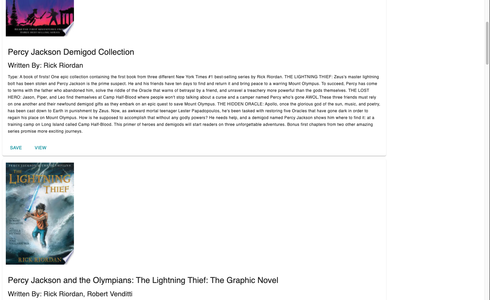

# Google Books Search

## Description

A web application that uses the Google Books API to view books and save them to a database. Once saved, users can view or delete the books. Each book displays an image, if they have one, the title, a list of authors, a description of the book, and a `View` button that opens up another tab of the book on Google Books. The application was developed using Mongoose, Express, Material-UI, and React.

## Usage

The application is deployed on Heroku. Vist the application [here](https://stormy-beyond-70546.herokuapp.com/).

## Images

* The start of the application, allowing a user to search a book.

* Search result for "Percy Jackson". A user can save a book or view it.

* A book is now saved into the database. A user can now delete it.

